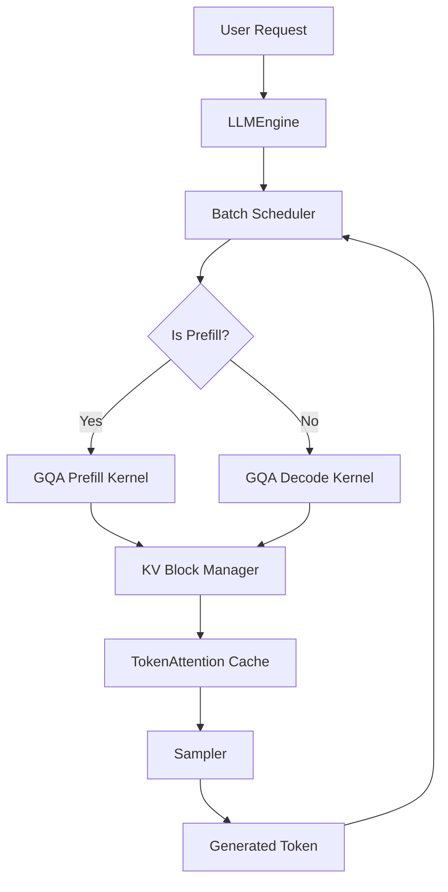

# lite_llama: Lightweight LLM Inference Engine

[]()
[]()
[]()
[]()
[]()

**lite_llama** is an enterprise-grade, high-performance LLM inference engine built from scratch. It is rigorously optimized for the **LLaMA-3** model family using custom Triton kernels and a dynamic, block-based KV cache. 

Our mission is to deeply understand and accelerate transformer inference. By implementing advanced techniques such as Grouped Query Attention (GQA), Rotary Position Embeddings (RoPE), and continuous batch scheduling natively in Triton, `lite_llama` achieves **~3.97× higher throughput** compared to standard HuggingFace Transformers.

## Key Features

- **Custom Triton Kernels**: Highly optimized kernels for fused RMSNorm, SwiGLU, and Attention, directly interacting with GPU memory hierarchies.
- **Dynamic Block-Based KV Cache (TokenAttention)**: Eliminates memory fragmentation and allows continuous, variable-length batching without Out-Of-Memory (OOM) errors.
- **Grouped Query Attention (GQA)**: Full math fidelity matching HuggingFace, but running significantly faster with less memory overhead.
- **Colab First**: Designed to run seamlessly in limited environments like Google Colab's 16GB T4 GPUs.
- **Continuous Batching**: A custom request scheduler ensures high GPU utilization by mixing prefill and decode sequences in a single forward pass.

## Architecture Flow



## Performance Benchmark

Targeting **Llama-3.2-3B** on a single GPU:

| Metric | Target |
|---|---|
| Throughput | ≥ 730 tokens/sec |
| Speedup vs HF | ≥ 3.97× |
| TTFT (2048 prompt) | ≤ 300ms |

*Automated scripts generate Matplotlib performance graphs directly in the Colab testing environment.*

## Quick Start (Colab / Linux)

```bash
git clone https://github.com/Paramveersingh-S/Lightweight-LLM-Inference-Engine.git
cd Lightweight-LLM-Inference-Engine
pip install -r requirements.txt # (assuming triton, torch, transformers)

# Run Benchmark
python benchmarks/bench_vs_hf.py
```

## Documentation
- [Architecture Overview](docs/architecture.md)
- [KV Cache Design](docs/kv_cache_design.md)
- [GQA Implementation](docs/gqa_implementation.md)
- [Benchmark Methodology](docs/benchmark_methodology.md)

## Testing
Run the correctness test suite using `pytest`:
```bash
pytest tests/
```
