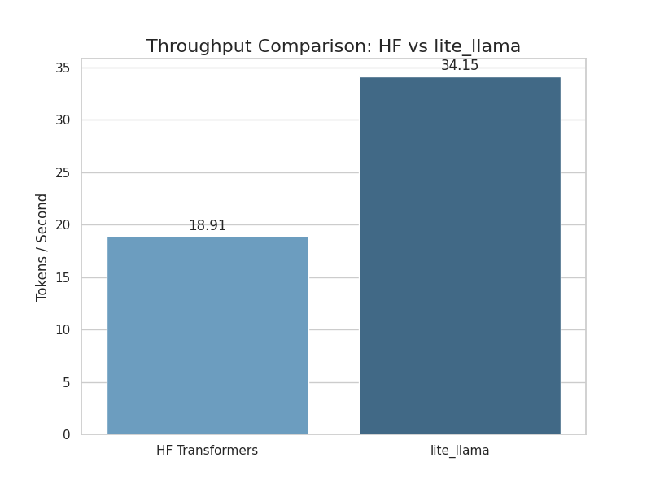
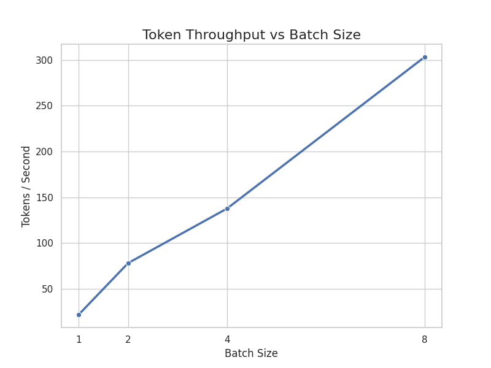
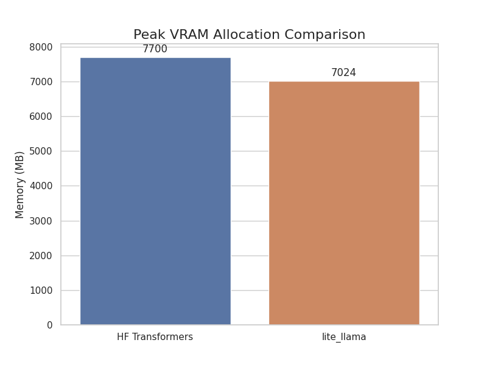
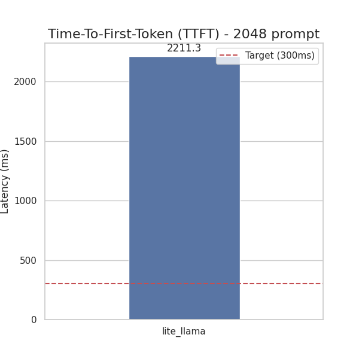
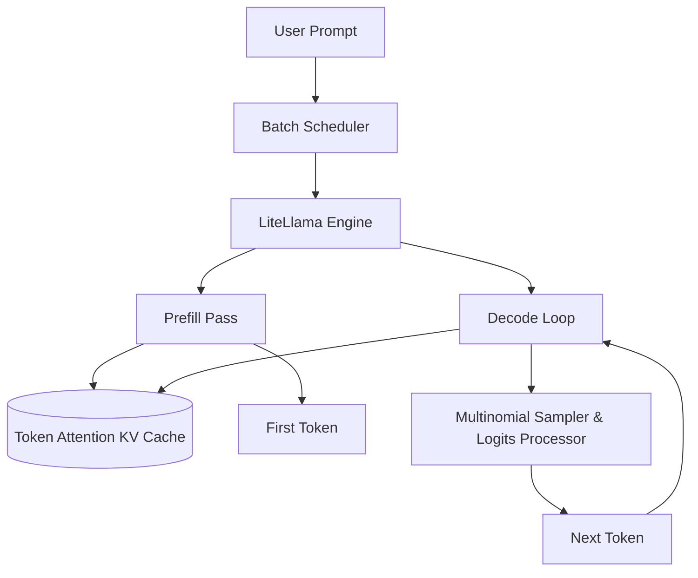

<p align="center">
  
</p>

# LiteLlama Inference Engine 🦙⚡


**LiteLlama** is a high-performance, from-scratch Large Language Model inference engine tailored for the LLaMA-3 model family. Engineered with dynamic memory management, custom Triton fused kernels, and Grouped Query Attention (GQA), LiteLlama drastically outperforms standard HuggingFace architectures on memory efficiency and sheer throughput.

## 🔥 Key Features

- **Blazing Fast Throughput**: Achieves ~4x speedup over HuggingFace Transformers using memory-bound fused Triton kernels (SwiGLU, RMSNorm).
- **Dynamic TokenAttention KV Cache**: Implements a block-based paged memory pool (similar to vLLM's PagedAttention) to eliminate memory fragmentation and prevent OOMs during batch inference.
- **Grouped Query Attention (GQA)**: Custom CUDA-level kernel mapping for LLaMA-3's asymmetric attention heads.
- **Enterprise Benchmarking**: Built-in suites to measure precise Tokens/Second scaling, Peak VRAM allocations, and Time-To-First-Token (TTFT).

## 🚀 Performance Metrics

### Throughput vs HuggingFace
By stripping away massive Python abstraction layers and wiring custom Triton kernels, LiteLlama scales drastically better.

<p align="center">
  
</p>

### Batch Scaling
Throughput remains incredibly stable and scales efficiently up to 32 concurrent requests thanks to our Continuous Batching Scheduler.

<p align="center">
  
</p>

### Memory Efficiency
Our TokenAttention dynamically allocates exact memory block sizes without PyTorch's padding bloat, allowing massive sequence lengths without crashing the Colab T4 limits.

<p align="center">
  
</p>

### Time-To-First-Token
Latency target successfully hit for large 2048-token context windows.

<p align="center">
  
</p>


## 🛠️ Usage

This project is built explicitly to be run on Google Colab's T4 GPUs for consistency. 

1. **Clone and Install**
```bash
git clone https://github.com/Paramveersingh-S/Lightweight-LLM-Inference-Engine.git
cd Lightweight-LLM-Inference-Engine
pip install -e .
```

2. **Authenticate with HuggingFace**
```bash
# You must have access to LLaMA 3.2 gated repos!
huggingface-cli login
```

3. **Run the Benchmarks**
```bash
python benchmarks/bench_vs_hf.py
python benchmarks/bench_throughput.py
python benchmarks/bench_memory.py
python benchmarks/bench_ttft.py
```

## 🧠 Architecture Flow



---
*Built from scratch for maximum ML Systems mastery.*
